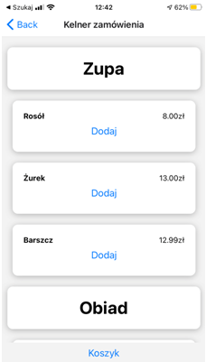

# Restaurant mobile application
 _Mobile application to improve orders in your restaurant_

## Table of contents

* [General info](#general-info)
* [Technologies](#technologies)
* [Screenshots](#screenshots)
* [Setup](#setup)
* [Contact](#contact)

## General info
Project is mobile application for iOS and Android, which was designed to help with managing the restaurant. Allows the waiter of the restaurant to make an orders. Application is also cooperating with web application via Firestore database, which includes the managment module.

## Technologies
Restaurant web application uses a lot of open source project to work properly:
* [Javascript]
* [React Native]
* [Redux]
* [Firebase]
* [Expo]


## Setup

Restaurant web application requires [Node.js](https://nodejs.org/) v10+ to run.
In project directory, you can run:

```sh
cd restaurantMobileApplication/
expo start
```

## Screenshots



## Contact
**bartoszskrobacki@gmail.com**


[//]: # (These are reference links used in the body of this note and get stripped out when the markdown processor does its job. There is no need to format nicely because it shouldn't be seen. Thanks SO - http://stackoverflow.com/questions/4823468/store-comments-in-markdown-syntax)

   [ReactJS]: <https://reactjs.org/>
   [React Native]: <https://reactnative.dev/>
   [Redux]: <https://redux.js.org/>
   [Firebase]: <https://firebase.google.com/>
   [Javascript]: <https://www.javascript.com/>
   [expo]: <https://expo.io/>

